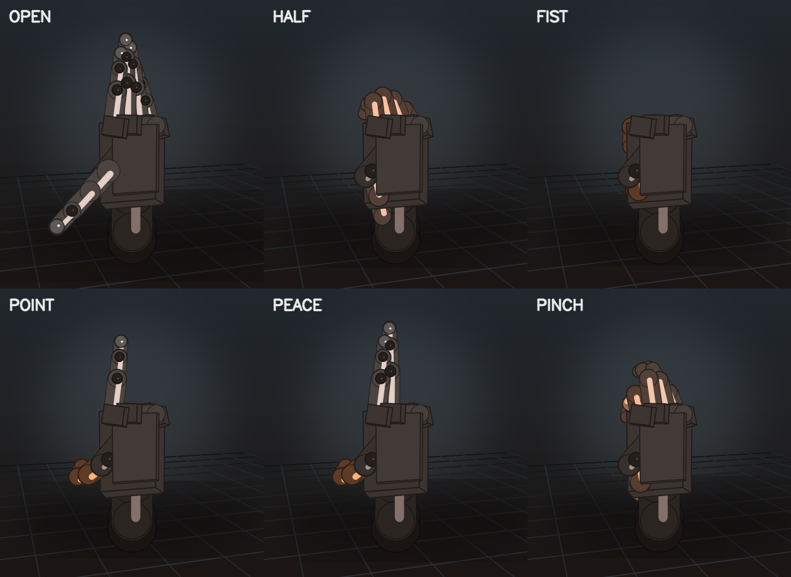

# robohand

Point a webcam at your hand. A simulated 5-finger robot hand mirrors it in
real time - finger by finger joint, plus wrist rotation and position.



*Left to right: open, half-closed, fist, point, peace, pinch.*

## How it works

```
webcam frame
   -> auto-exposure (CLAHE)
   -> MediaPipe Hands: 21 landmarks per hand
   -> per-finger joint angles (curl from PIP/DIP angles + tip distance)
   -> palm basis matrix (wrist orientation)
   -> One Euro filter            <- kills jitter without adding lag
   -> forward kinematics         <- 5 fingers x 3 revolute joints
   -> software 3D renderer       <- perspective + depth sort, no OpenGL
```

The camera panel is colour-coded: **green** finger extended, **orange** curled,
and a ring appears around the thumb tip when you pinch.

## Requirements

* Linux / macOS / Windows, a webcam, Python **3.9 - 3.12**
* **Python 3.12 is what this was built and tested against.**

> MediaPipe ships wheels for CPython 3.9-3.12 only. On Python 3.13 or 3.14
> `pip install mediapipe` has no compatible wheel, which is why the venv below
> pins 3.12.

## Install and run

```bash
cd robohand
./run.sh                  # creates .venv on first run, then tracks camera 0
```

Prefer to do it by hand:

```bash
uv venv --python 3.12 .venv          # or: python3.12 -m venv .venv
uv pip install --python .venv/bin/python -r requirements.txt
.venv/bin/python -m robohand
```

Check the simulation without a camera at all:

```bash
./run.sh --demo
```

## Controls

| key | action |
| --- | --- |
| `Q` / `Esc` | quit |
| `H` | help overlay |
| `SPACE` | freeze the sim (tracking keeps running) |
| `0` | clear the preset, follow the camera again |
| `1` - `7` | canned poses: open / half / fist / yoke / pinch / flat / scissors |
| `S` | save a screenshot to `./captures` |
| `M` | toggle the mirrored view |
| `G` | toggle the 3D floor grid |
| `C` | toggle camera auto-follow |
| `[` / `]` | less / more input smoothing |

## Tuning

| flag | effect |
| --- | --- |
| `--gain 1.5` | raise if the robot hand never fully closes |
| `--gain 1.0` | lower if it curls shut when your hand is relaxed |
| `--smoothing 0.2` | more responsive, more jitter |
| `--smoothing 0.8` | steadier, more lag |
| `--move-gain 0.4` | how far across the scene hand movement carries the rig |
| `--rotate 0` | ignore wrist rotation (fingers only) |
| `--max-hands 1` | single hand, renders at higher quality |
| `--model-complexity 0` | faster detection, slightly weaker on hard poses |
| `--no-brightness` | disable the auto-exposure pass |
| `--no-mirror` | do not mirror the preview |
| `--source 1` | pick a different camera, or pass a video file path |
| `--record out.mp4` | write the window to a video |

## If the hand is not detected

1. **Light it properly.** Hand tracking needs real light - gain cannot invent a
   hand out of a black frame. The app warns you when the feed is too dark.
2. Keep the hand in frame, palm roughly 30-60 cm from the lens.
3. Avoid motion blur and heavy backlighting.
4. Try `--model-complexity 0` for a speed boost.

## Simulating in RViz / Gazebo / MoveIt

The rig is not just a picture — it is a real 15-joint kinematic chain with
anatomical limits, so it exports cleanly to URDF and behaves identically in any
simulator.

```bash
# export the model
.venv/bin/python -m robohand --export-urdf hand.urdf
.venv/bin/python -m robohand --export-urdf hand_L.urdf --hand Left

# view it, with sliders to pose the hand
cd ros2_ws && colcon build && source install/setup.bash
ros2 launch robohand_sim view_hand.launch.py

# or let it animate open/close on its own
ros2 launch robohand_sim view_hand.launch.py animate:=true

# and/or spawn it in Gazebo as well
ros2 launch robohand_sim view_hand.launch.py gazebo:=true
```

| joint | count | axis | limits |
| --- | --- | --- | --- |
| `{index,middle,ring,pinky}_{mcp,pip,dip}` | 12 | local X | 0 – 95° / 105° / 65° |
| `thumb_{mcp,pip,dip}` | 3 | local X (negated on the left hand) | 0 – 42° / 46° / 62° |

Joint limits are **read out of the URDF** by `robohand_bridge.py`, so the
angles it publishes are the physical ones — not arbitrary 0-1 values.

### Driving the simulator with your actual hand

```bash
tools/live_ros_demo.sh Right      # webcam -> /joint_states -> RViz (+ Gazebo)
```

That starts `robot_state_publisher`, RViz, and the webcam app with `--ros`, so
moving your hand moves the simulated hand. The app spawns the bridge itself:

```bash
# or drive it yourself from an already-running app
.venv/bin/python -m robohand --ros ros2_ws/src/robohand_sim/urdf/robohand_Right.urdf
```

The HUD shows a live `ROS +<frames>` counter so you can tell it is connected.
Each finger's 0-1 flexion ratio is scaled by that joint's real maximum, read
out of the URDF, so the RViz hand shows true joint angles.

**Why a subprocess?** The app runs in a Python 3.12 venv (MediaPipe has no 3.13+
wheels) while ROS 2 here needs Python 3.14, so they cannot share an
interpreter. `ros_bridge.py` spawns the bridge inside a shell that sources the
ROS environment, then streams one line of flexion values per frame over stdin.

Verify the whole stack headlessly (launches, publishes, moves, TF resolves):

```bash
tools/verify_ros2_sim.sh Right    # animation + TF
tools/verify_live_ros.py          # live webcam path, open/fist/point
```

It launches without RViz, samples `/joint_states` six times, and asserts that
15 joints are published, that they actually travel, and that
`robot_state_publisher` turns them into 15 TF transforms.

### What the URDF is checked against

`tests/test_urdf.py` re-implements URDF forward kinematics independently,
parses the generated file, and asserts the link positions match
`RobotHand.chain()` to 1e-6 at five different poses, for both hands. If the
simulator and the on-screen hand ever disagree, the tests fail.

## Layout

```
robohand/
  math3d.py         rotation matrices, vector helpers
  smoothing.py      One Euro filter, FPS meter
  hand_tracker.py   MediaPipe wrapper -> joint angles + palm basis
  robot_hand.py     the rig: FK, joint limits, hand-drawn primitives
  renderer.py       pinhole camera, depth-sorted rasteriser
  gestures.py       FIST / POINT / PINCH ... with hysteresis
  demo.py           scripted motion for camera-free testing
  app.py            capture loop, HUD, CLI
  urdf_export.py    generates the URDF straight from FINGER_RIG
ros2_ws/src/robohand_sim/
  urdf/             robohand_Right.urdf, robohand_Left.urdf
  launch/           view_hand.launch.py
  scripts/          robohand_bridge.py  (publishes /joint_states)
tests/              62 unit tests
tools/              pose sheet, headless self-test, ROS 2 verifier
```

The renderer is deliberately pure numpy + OpenCV: no OpenGL, no EGL, no mesh
files. It runs headless, over SSH, and inside containers, and the hand is a
small analytic rig rather than an imported model, so every joint angle in the
UI corresponds to a real degree value you could send to a servo.

## Tests

```bash
PYTEST_DISABLE_PLUGIN_AUTOLOAD=1 .venv/bin/python -m pytest tests/ -q
```

Covers the curl estimator against synthetic straight/curled chains, gesture
disambiguation, forward kinematics (fingertips must travel toward the palm as
the finger closes), left/right mirroring, the projection maths, and the One
Euro filter's jitter/latency trade-off.

Generate a pose sheet or render the app headlessly:

```bash
.venv/bin/python tools/render_poses.py
.venv/bin/python tools/selftest.py --source demo --frames 120
tools/verify_ros2_sim.sh Right
```
